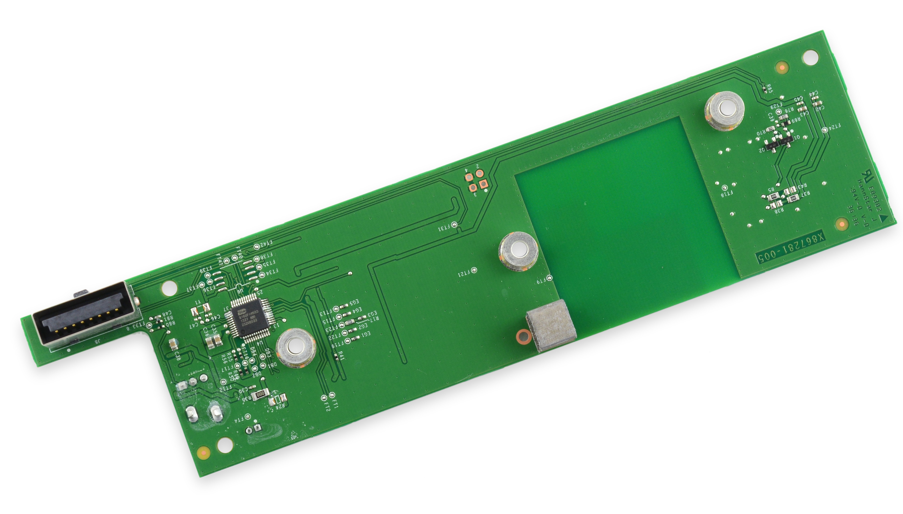

# RF Unit

## Info

### Xbox One (PHAT)

Part Number: X867281-005
Codename: Lithium

Components:

- Infrared Receiver (U1)
- Soundchip - ISD9160F (U4)
- Connector to sound speaker (J1)
- Wifi Antenna connector (J2)
- FPC connector (J3)
- Motherboard connector (J8)
- Unpopulated (SW2)

####  General

The RF Unit, compared to Xbox 360, is very simple. It does not contain any RF hardware onboard.
It only contains an IR Receiver, the Nuvoton Soundcorder Chip (which also handles button presses from the front panel touch buttons) and an internal antenna.
Actual RF communication is happening via [Wifi module](wifi.md).

Communication from the Nuvotun chip to the Southbridge is done via I2C.

#### Connector (J8)

Pinout

| Pin| Function        |
|----|-----------------|
|  1 | LED Nexus       |
|  2 | LED Halo        |
|  3 | LED Zone        |
|  4 | 5V (VCC)        |
|  5 | I2C CLK         |
|  6 | I2C DATA        |
|  7 | IR Data         |
|  8 | PWR Switch (N)  |
|  9 | GND             |
| 10 | EJECT Switch (N)|
| 11 | INT_N           |
| 12 | 3,3V STDBY      |
| 13 | BIND Switch (N) |
| 14 | GND             |
| 15 | -               |
| 16 | -               |
| 17 | -               |
| 18 | GND             |
| 19 | GND             |

#### FPC Connector (J3)

Pinout

| Pin | Function | ISD9160F Pin |
| ----| ---------| -------------|
| 1   |  Power   |            9 |
| 2   |  Power   |            8 |
| 3   |  -       |             -|
| 4   |  -       |             -|
| 5   |  -       |             -|
| 6   |  Eject   |            7 |
| 7   |  Eject   |            6 |

Bridge the respective pins briefly to trigger action.

FPC Cable / capacitive front panel buttons are directly wired to the ISD-Chip.

#### Nuvoton Soundcorder chip (U4)

Responsible for playing the power-on/off and eject sounds.

Model: ISD9160F

Datasheet: [ISD9160FI](../_files/rf-unit/1811151450_Nuvoton-Tech-ISD9160FI_C79806.pdf)

Pinout (from the official datasheet linked above)


This IC has multiple possible pin-configurations, the following are verified signals.

| Pin | Function                   |
| --- | -------------------------- |
|   6 | Eject button (FPC - Pin 7) |
|   7 | Eject button (FPC - Pin 6) |
|   8 | Power button (FPC - Pin 2) |
|   9 | Power button (FPC - Pin 1) |
|  47 | I2C SCL (CLK)              |
|  46 | I2C SDA (DAT)              |

##### I2C

Captured via Logic Analyzer from Pin 5,6 on RF Unit.

I2C address: `0x5A`

Commands

| Byte | Name           | Args           | Reads data |
| ---- | -------------- | -------------- | ---------- |
| 0x48 | Register Write | Register, Data | No         |
| 0xC0 | Interrupt Read | /              | Yes        |
| 0xC1 | Register Read  | /              | Yes        |
| 0xC3 | Flash Read     | Address U32-LE | Yes        |
| 0x81 | Start Sound    | Sound index    | No         |
| 0x02 | Stop Sound     | /              | No         |
| 0x42 | Reset          | 0x55           | No         |

Registers

| Num  | Name     | Read/Write |
| ---- | -------- | ---------- |
| 0x0C | Status   | READ-ONLY  |
| 0x04 | Address0 | R/W        |

Available sounds

| Index| Name         |
| ---- | ------------ |
| 0x00 | PowerOn      |
| 0x01 | Ding         |
| 0x02 | PowerOff     |
| 0x03 | DiscDrive1   |
| 0x04 | DiscDrive2   |
| 0x05 | DiscDrive3   |
| 0x06 | Plopp        |
| 0x07 | No Disc      |
| 0x08 | Plopp Louder |

Init sequence:

```
WRITE [CMD_REGISTER_WRITE, REG_STATUS, 0x01]
WRITE [CMD_REGISTER_WRITE, REG_ADDR0, 0xFF, 0xFF]
```

Play sound

```
WRITE [CMD_START, SOUND_INDEX]
```

Stop sound

```
WRITE [CMD_STOP]
```

Reset

```
WRITE [CMD_RESET, 0x55]
```

Write register

```
WRITE [CMD_REGISTER_WRITE, <REGISTER>, <DATA>]
```

Read register

```
WRITE [CMD_REGISTER_READ, <REGISTER>]
READ <DATA>
```

Read interrupt

```
WRITE [CMD_INTERRUPT_READ]
READ <DATA>
```

Flash read

```
WRITE [CMD_FLASH_READ, <Address as UINT32, little endian>]
READ <DATA> (8 bytes)
* Cut off first 2 bytes to yield 6 bytes of flash data
```

To get a sound playing, this is the full flow done by the console

```
- Init
- Stop
- Play sound
```

### Xbox One S

Codename: Sodium

#### Pinout

Connector

| Pin| Function        |
|----|-----------------|
|  1 | LED Nexus       |
|  2 | -               |
|  3 | IR Blaster      |
|  4 | PWR Switch (N)  |
|  5 | EJECT Switch (N)|
|  6 | INT_N           |
|  7 | 3,3V STDBY      |
|  8 | 5V              |
|  9 | ACC_RESET       |
| 10 | IR (RX)         |
| 11 | GND             |
| 12 | USB2 (-)        |
| 13 | USB2 (+)        |
| 14 | GND             |
| 15 | I2C CLK         |
| 16 | I2C DATA        |

### Xbox One X

Codename: Cactus

**NOTE**: Front panel on Xbox One X does not use I2C anymore.

#### Pinout

| Pin| Function        |
|----|-----------------|
|  1 | IR (RX)         |
|  2 | EJECT Switch (N)|
|  3 | -               |
|  4 | IR Blaster      |
|  5 | ACC_RESET       |
|  6 | GND             |
|  7 | USB2 (-)        |
|  8 | USB2 (+)        |
|  9 | 3,3V STDBY      |
| 10 | GND             |
| 11 | -               |
| 12 | -               |
| 13 | -               |
| 14 | PWR Switch (N)  |
| 15 | LED Nexus       |
| 16 | 5V              |

## Pictures
Xbox One (PHAT)




Xbox One S


Xbox One X (SCORPIO)

## Tools

- [DuRFUnitI2C] - (Python) Communicate with the (PHAT) RF Unit and dump its flash
## Credits
- [Pictures from ifixit.com](https://www.ifixit.com/Search?c-doctype_namespace=product&doctype=product&query=xbox%20one)