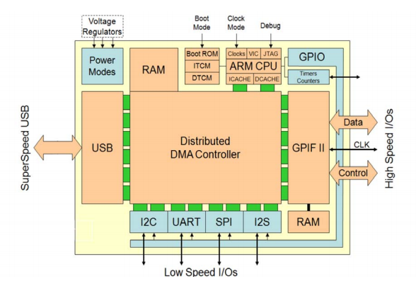
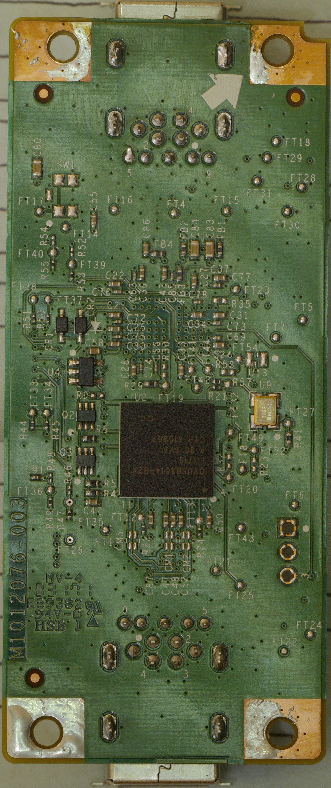

# XDK Transfer Device

The XDK Transfer Device is a special hardware accesory available officially only to registered Xbox developers. Its main purpose is to allow for very fast transfers of data, mainly aimed at dumping GPU information to a PC for debugging purposes, and maybe also transfering game builds during the development phase. It is presumably no longer needed for the next generation of consoles (Series X/S) since these natively support fast data transfer rates thanks to their SSD technology
. These devices are typically sold for cheap on eBay and similar marketplaces since they don't have any real use for normal gamers.

## Hardware

The XDK Transfer Device box contains four TORX head screws located in the back of the device, under the sticker:

Internally, the device contains two heatsinks for heat disipation when doing data transfers. The PCB has a rectangular shape.

The XDK Transfer device contains two `ATMLH532` i2c EEPROMs and two main `CYUSB3014-BZXI` ICs, which are essentially dedicated ARM926 EJ-S cores capable of 5 GBit/s USB speeds. The following is a block diagram depicting the design and main features of these cores. 

Full board scans (thanks to @cactus for the help):

NOTE: Click on the image to load high-resolution image!

Back:

[[XDK Transfer - frontside](../_files/xdk_transfer/transfer_back.jpg)

## Software

The SystemOS driver that communicates with the XDK Transfer Device is called `xbtplinkc.sys` and can be found in C:\Windows\System32. Its full name is the `Xbox Transport Protocol Link Client` driver. The "Client" part of the name is Hyper-V terminology, hence we can presume there exists a counterpart XbtpLinkP (provider) driver in the HostOS, which dispatches requests.

There are (at least) two known major versions of this SystemOS driver. XbtplinkC from 2017/2018 OS's is a very small driver in size (just a dozen Kb), while the driver in the latest OS revisions (2023) performs more tasks and is bigger in size (around 50 Kb).

The driver registers the device `\\??\\XbtpLink` but does not create any symlinks available to userland. In other words, it cannot receive IOCTLs from userland apps. The drivers does handle some IOCTLs, so it might [receive IOCTLs from other kernel drivers](https://learn.microsoft.com/en-us/windows-hardware/drivers/kernel/creating-ioctl-requests-in-drivers), though.

The following two IOCTL are handled:

|  Code     | Name      | Description  |
|-----------|-----------|--------------|
| 0x220007  | Unknown   | Unknown      | 
| 0x22000b  | Unknown   | Unknown      | 

## Userland Software

Additionally, a userland DLL called `xbtp.dll` can be found in `J:\tools\` in developer mode consoles. More investigation is required but this is likely used by some app which communicates with the XBTPLinkC driver.
